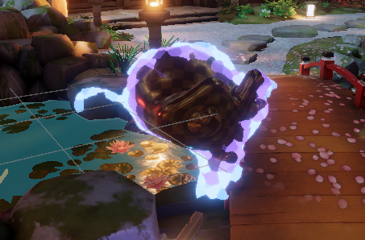
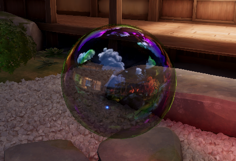
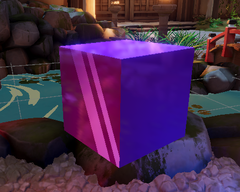

# Tetra Unity Shaders
A collection of shaders made on Unity 
To use, simply clone this repo in your Unity "Assets" folder
***
# Contents
## Shaders
### Assemble shader

* Made on Unity URP 14 (Unity 2022.3.30f1)
* Transparent
### Bubble shadder (thin-film interference)

* Made on Unity URP 14 (Unity 2022.3.30f1)
* Transparent
### Stylized crystal shader

* Made on Unity URP 14 (Unity 2022.3.30f1)
* Opaque
## Utils
* Random/noise functions
  - 2,3,4 parameter PRNGs
  - Voronoi noise 
* Interference utils
  - Thin-film filter
  - Wavelength to RGB converter 
